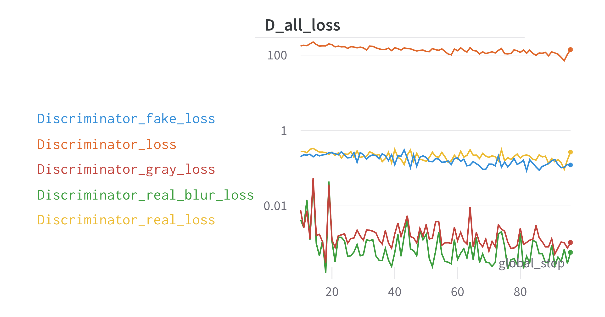
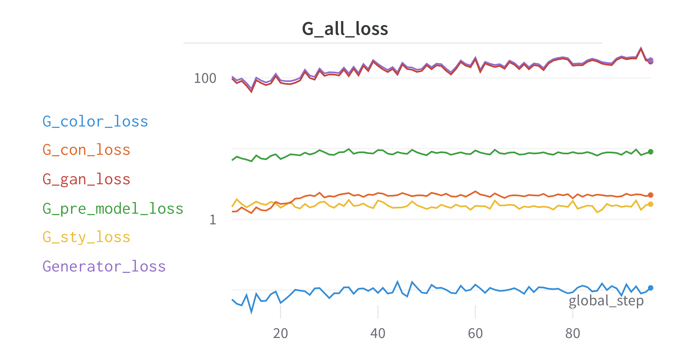
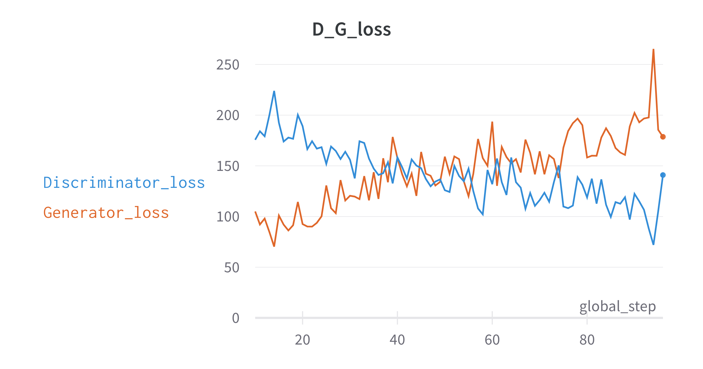
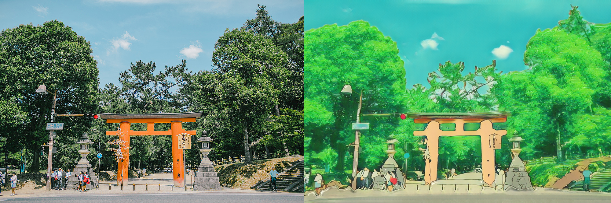
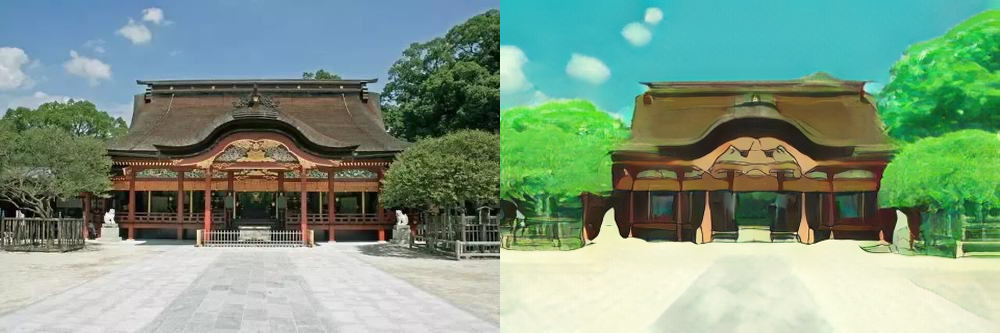
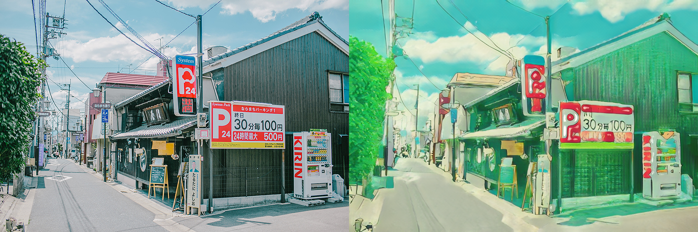

# AnimeGANv2_Tensorflow2     [中文](README_ZH.md)
Reference source [AnimeGANv2](https://github.com/TachibanaYoshino/AnimeGAN) project, rewritten with TensorFlow2 to implement

## Installation and testing environment

GPU：3060 batch_size=10 Training time is 11min/epoch

- tensorflow==2.8.0
- tensorflow-addons==0.16.1
- wandb
- tqdm==4.63.1
- PyYAML
- opencv-python==4.5.5

## Usage

### Training

```shell
python train.py --config_path config/config-defaults.yaml --dataset Hayao --hyperparameters False
```

- `--config_path` the configuration file path is under `config/config-defaults.yaml` by default, which is the hyperparameter configuration of the project
- `--dataset` the name of the dataset
- `--hyperparameters` whether to enable hyperparameter search for wandb

### Testing

### Training process

### loss variation

Discriminator related losses




Generator related losses




Relative change in loss of generators and discriminators



As can be seen from the loss, the generator and discriminator produced an obvious confrontation effect, the generator loss into an upward trend, discriminator loss into a downward trend, due to the training of the relevant loss weight is in accordance with the way recommended by the original author, and the original author training effect has a certain difference, you need to adjust again

### Image verification results







The overall animation style of the picture effect is relatively strong compared to the original author, but the picture details are missing more and the picture color is stronger, which needs to be further improved by adjusting the loss weight


## License
- This version is for academic research and non-commercial use only, if used for commercial purposes, please contact me for licensing approval